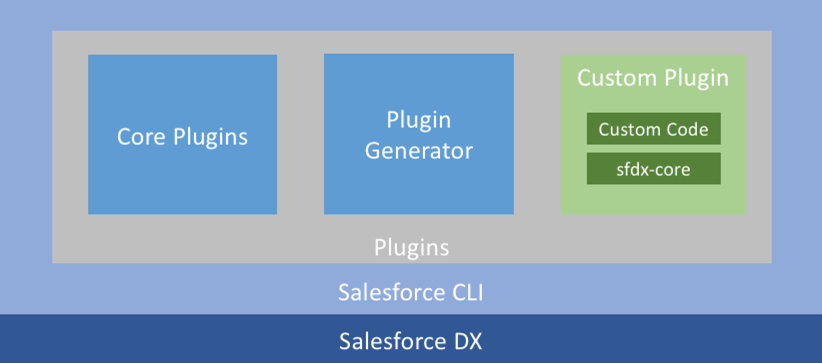

sfdx-ext
========

# Name
sfdx extensions

# Description
This is a Salesforce CLI plugin which is used in conjunction with SFDX.
It provides custom utility features that we require for working on a day-to-day basis.

# Overview
<br>

# Getting Started
### Clone this repository
``` git clone <repo> ```

### Install Dependencies
``` npm install```

### Install the plugin
``` sfdx plugins:link . ```

### Confirm the installation
``` sh-session
sfdx plugins
> sfdx-ext 0.0.1 (link) /sfdx-ext
```

# Usage

# More information
https://developer.salesforce.com/blogs/2018/05/create-your-first-salesforce-cli-plugin.html